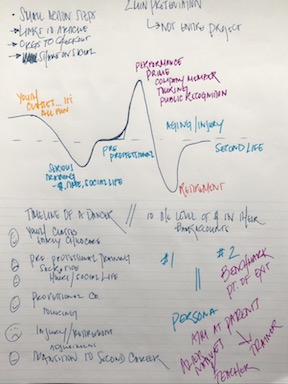

# Part I: Final Project 
## Outline
### Summary

Financial investment in professional dance training begins decades before the average person even chooses a career path, and yet the income stream for most dancers dries up before they reach the age of 35. Start early and end early, the cost of a formal dance education often vastly exceeds potential income oppurtunities over time.
### Structure
#### highlights of the story

- discrepancies in investment vs. income
- comparisons to cost and time of training required for other professions 
- small chance of success
- the cost of a second career

#### story arc

The story will follow the timeline of a dancer's career:
- the initial joys of discovery
- the sacrifices and struggles of pre-professional training
- the rewards and satisfaction at a performer's prime
- the decline from age and injury to a premature retirement
- the challenges of preparing for a second career

#### call to action 

Like or follow a local dance group!
- link to list of professional companies

Go see a show!
- link to local dance events calendar

Donate to Dance/USA!
- link to giving site

In highlighting the effort and investment of professional dancers, I hope broader awareness of the work behind the curtain will lead to increased appreciation of what the audience sees on stage. 
## Initial Sketches

## Examples of Existing Visualizations
From FiveThirtyEight  
  
From Data USA  

## Data
### Sources and Links: 
- Data USA [*Dancers & Choreographers*](https://datausa.io/profile/soc/dancers-choreographers)
- FiveThirtyEight [*Raising A Ballerina Will Cost You $100,000*](https://fivethirtyeight.com/features/high-price-of-ballet-diversity-misty-copeland/#fn-2) 
- US Bureau of Labor Statistics [*Dancers and Choreographers*](https://www.bls.gov/ooh/entertainment-and-sports/dancers-and-choreographers.htm#tab-1) and [*Dancers: Occupational Employment and Wages, May 2019*](https://www.bls.gov/oes/current/oes272031.htm#st)
- ICPSR [*The aDvANCE Project: A Study of Career Transition for Professional Dancers*](https://www.icpsr.umich.edu/web/ICPSR/studies/35598/summary)

>Abrams, Abby. “Raising A Ballerina Will Cost You $100,000.” FiveThirtyEight (blog), August 20, 2015. https://fivethirtyeight.com/features/high-price-of-ballet-diversity-misty-copeland/.  
“Dancers.” Accessed November 22, 2020. https://www.bls.gov/oes/current/oes272031.htm#st.  
“Dancers & Choreographers | Data USA.” Accessed November 22, 2020. https://datausa.io/profile/soc/dancers-choreographers.  
“Dancers and Choreographers : Occupational Outlook Handbook: : U.S. Bureau of Labor Statistics.” Accessed November 22, 2020. https://www.bls.gov/ooh/entertainment-and-sports/dancers-and-choreographers.htm#tab-1.  
Healy, Rachael. “Dance, Sport and the Unspoken Trauma of Retirement.” Huck Magazine, January 18, 2019. https://www.huckmag.com/outdoor/sport-outdoor/dance-sport-and-the-unspoken-trauma-of-retirement/.  
Levine, Mindy N. “Beyond Performance: Building a Better Future For Dancers and the Art of Dance,” n.d., 65.  
“List of Dance Companies.” Accessed November 22, 2020. https://www.danceonline.co.uk/list-of-dance-companies.html.  
Three Acts, Two Dancers, One Radio Host. “Three Acts, Two Dancers, One Radio Host.” Accessed November 22, 2020. http://3acts2dancers1radiohost.com/.

A couple of paragraphs that document data sources and how data will be used.

## Method and Medium
How the project will be completed? 
Platform for the final project identified.

