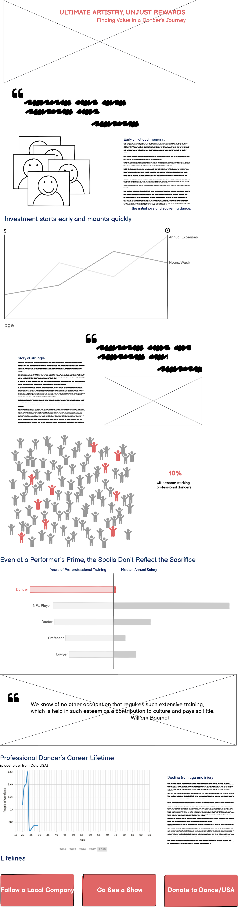
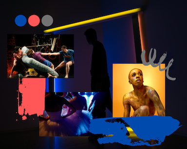
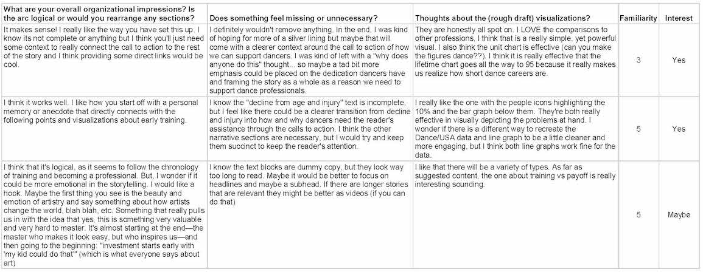

# Final Project: Part II
> **“A dancer dies twice—once when they stop dancing, and this first death is more painful.”**   - Martha Graham

## Storyboard via Wireframes
Made in [Balsamiq](https://balsamiq.com/)  

## Moodboard
Made in [Canva](https://www.canva.com/)  

## User Research and Interviews
### Protocols:
#### Target Audience
- People who have limited understanding/appreciation of concert dance forms like modern and ballet.

#### Representative Individuals to Interview
- My program cohort already has a demonstrated interest in the fine and performing arts, but few have extensive exposure to concert dance. 
- A graphic designer who has little to no experience with dance, but lots with design. 

#### Interview Script and Responses
 

#### Findings
While the dummy text blocks look dense, it was not my intention to imply that I would be writing that much content. Definetly something to keep in mind for future wireframes. The story arc seemed easy for all to follow, but I do love the idea of pulling out a *hook* for the beginning of the presentation. Also a few people mentioned moving elements, like animation or video. As it is a story about dance it would be worth finding a way to create movement within the visuals. 

## To Do List
- [ ]  &nbsp; recreate visualizations with real data
- [ ]  &nbsp; finalize story elements
- [ ]  &nbsp; what's the hook?
- [ ]  &nbsp; find a silver lining to inspire action at the end, less doom and gloom
- [ ]  &nbsp; is there a way to incorporate motion?
