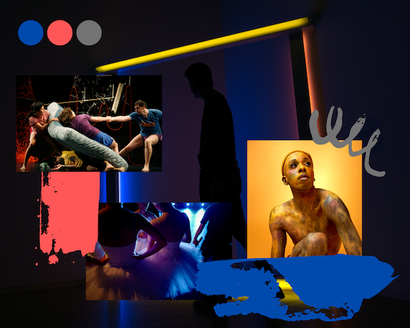

# Part II: Final Project 
> **“We know of no other occupation that requires such extensive training, which is held in such esteem as a contribution to culture and pays so little.”** - William Baumol

## Storyboard via Wireframes
Made in [Balsamiq](https://balsamiq.com/)

## User research and interviews

### protocols:
a. the target audience you hope to reach with your story; 
b. your approach to identifying representative individuals to interview; 
c. your interview script; 
d. the findings from your interviews; and 
e. changes you plan on implementing to your visualizations next week to address the issues identified. 

### findings
Include any helpful direct quotes for each question you asked, 
and make sure to note similarities and differences between the observations of your interviewees.  

## moodboard
Made in [Canva](https://www.canva.com/)

