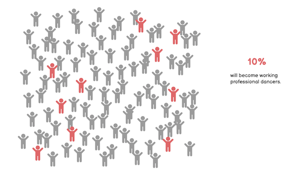

# Final Project: Part III
> **“The inadequacy of transition support not only creates significant challenges for individual dancers, but also imposes a social cost in the form of wasted human capital.”** - William Baumol

## But first, recaps...
[Part I](FinalProject_Part1.md)

[Part II](FinalProject_Part2.md)

## ...and reflections
### Ch-ch-ch-ch-changes
From this dual axis line chart wireframe in [Balsamiq](https://balsamiq.com/) 
 
to this single stacked bar chart made using [Flourish](https://flourish.studio/). 

I was unable to access a more detailed dataset with breakdowns of cost by age, only the final totals of categorical costs associated with serious ballet conservatory training. The data points spanned a whole 15 year period. Ultimately, the impact of the heavy financial burden was stronger as a "grand" total. And the vertical orientation let my play with a sort of rising child star/rising cost dynamic. Instead of embedding directly, I downloaded the visual as a serious of deconstructed jpegs and then reanimated using the reveal feature in Shorthand. Overall this result seemed more effective than my original option, which garnered little interest during feedback sessions and interviews. 
 

The simple disorganization of the figures in what would otherwise be a typical unit chart, brought me so much joy. I was glad others felt similarly upon seeing it. In a presentation about a movement art form, it was important to create a sense of motion in the presentation. This simple idea stayed pretty consistent, but I did create a sort of GIF effect to make them high kick in the final story.
  
Made in [Canva](https://www.canva.com/)

### Audience
- insights from interviews
- personas
- design lessons learned

## Final Data Story
Made in [Shorthand](https://shorthand.com/)  
### [*Ultimate Artistry, Unjust Rewards: Finding Value in the Dancer's Dream*](https://carnegiemellon.shorthandstories.com/ultimate-artistry-unjust-rewards/index.html)

### References
- Abrams, Abby. “Raising A Ballerina Will Cost You $100,000.” FiveThirtyEight (blog), August 20, 2015. https://fivethirtyeight.com/features/high-price-of-ballet-diversity-misty-copeland/.  
- Pop Warner Little Scholars. “Ages & Weights.” Accessed December 5, 2020. https://www.popwarner.com/Default.aspx?tabid=1476162. 
- “Architects, except Naval | Data USA.” Accessed December 8, 2020. https://datausa.io/profile/soc/architects-except-naval. 
- “Architects : Occupational Outlook Handbook: : U.S. Bureau of Labor Statistics.” Accessed December 5, 2020. https://www.bls.gov/ooh/architecture-and-engineering/architects.htm#tab-1. 
- “Artists and Other Cultural Workers: A Statistical Portrait.” National Endowment for the Arts, April 2019. 
- Baumol, William J, Joan Jeffri, and David Throsby. “Making Changes: Facilitating the Transition of Dancers to Post-Performance Careers.” The aDvANCE Project, 2004. 
- “BFAMFAPhD_ArtistsReportBack2014-10.Pdf.” Accessed November 22, 2020. http://bfamfaphd.com/wp-content/uploads/2016/05/BFAMFAPhD_ArtistsReportBack2014-10.pdf. 
- Actors Fund. “Career Transition For Dancers,” October 24, 2015. https://actorsfund.org/services-and-programs/career-transition-dancers.  
- “Dancers & Choreographers | Data USA.” Accessed November 22, 2020. https://datausa.io/profile/soc/dancers-choreographers. 
- “Dancers and Choreographers : Occupational Outlook Handbook: : U.S. Bureau of Labor Statistics.” Accessed December 5, 2020. https://www.bls.gov/ooh/entertainment-and-sports/dancers-and-choreographers.htm#tab-1. 
- National Center for Science and Engineering Statistics. “Doctorate Recipients from U.S. Universities: 2019 | NSF - National Science Foundation,” 2019. https://ncses.nsf.gov/pubs/nsf21308/report. 
- Friscia, Suzannah. “Is the Line Between Concert and Commercial Dance Finally Fading?” Dance Magazine, June 23, 2020. https://www.dancemagazine.com/concert-dance-vs-commercial-dance-2646233472.html. 
- Healy, Rachael. “Dance, Sport and the Unspoken Trauma of Retirement.” Huck Magazine, January 18, 2019. https://www.huckmag.com/outdoor/sport-outdoor/dance-sport-and-the-unspoken-trauma-of-retirement/. 
- “Lawyers, & Judges, Magistrates, & Other Judicial Workers | Data USA.” Accessed December 8, 2020. https://datausa.io/profile/soc/lawyers-judges-magistrates-other-judicial-workers. 
- “Lawyers : Occupational Outlook Handbook: : U.S. Bureau of Labor Statistics.” Accessed December 5, 2020. https://www.bls.gov/ooh/legal/lawyers.htm#tab-1. 
- Levine, Mindy N. “Beyond Performance: Building a Better Future For Dancers and the Art of Dance.” The aDvANCE Project, n.d. 
- Live Science Staff. “Babies Are Born to Dance.” livescience.com, 15 2010. https://www.livescience.com/6228-babies-born-dance.html. 
- Statista. “NFL: Average Career Length.” Accessed December 7, 2020. https://www.statista.com/statistics/240102/average-player-career-length-in-the-national-football-league/. 
- A-Z Quotes. “Paulo Coelho Quote.” Accessed December 9, 2020. https://www.azquotes.com/quote/521833. 
- National Dance Education Organization. “Philosophy Underlying the Standards for Dance in Early Childhood.” Accessed December 5, 2020. https://www.ndeo.org/content.aspx?page_id=22&club_id=893257&module_id=55419. 
- “Physicians and Surgeons : Occupational Outlook Handbook: : U.S. Bureau of Labor Statistics.” Accessed December 5, 2020. https://www.bls.gov/ooh/healthcare/physicians-and-surgeons.htm#tab-1. 
- “Postsecondary Teachers | Data USA.” Accessed December 8, 2020. https://datausa.io/profile/soc/postsecondary-teachers. 
- “Postsecondary Teachers : Occupational Outlook Handbook: : U.S. Bureau of Labor Statistics.” Accessed December 5, 2020. https://www.bls.gov/ooh/education-training-and-library/postsecondary-teachers.htm#tab-1. 
- Robb, Alice. “The Afterlife of a Ballerina.” ELLE, October 17, 2016. https://www.elle.com/culture/a39990/alexandra-ansanelli-prima-ballerina-career/. 
- “Surgeons | Data USA.” Accessed December 8, 2020. https://datausa.io/profile/soc/surgeons. 
- Thompson, Jayne. “The Salaries of Ballet Dancers.” Chron, July 1, 2018. https://work.chron.com/salaries-ballet-dancers-5128.html. 
- A-Z Quotes. “W. H. Auden Quote.” Accessed December 9, 2020. https://www.azquotes.com/quote/532276. 
- Woodruff, Jim. “How Much Money Does an NFL Player Make a Year?” Chron, July 1, 2018. https://work.chron.com/much-money-nfl-player-make-year-2377.html. 

# Ultimately it's always [about me](/README.md).
