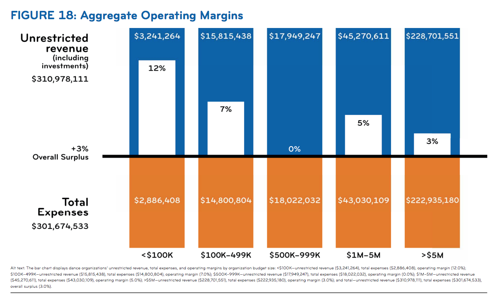
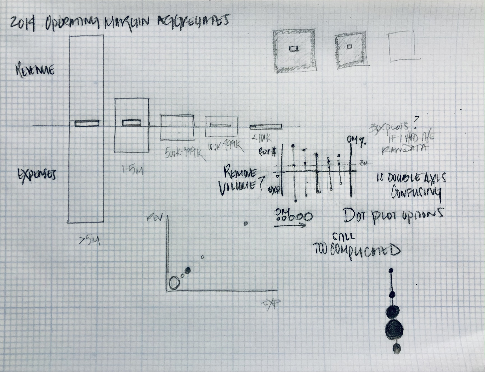

# Critique by Design

## Aggregate Operating Margins - Fiscal Year 2014
From Dance/NYC Report [*State of NYC Dance & Workforce Demographics 2016*](https://culturaldata.org/media/1452/state-of-nyc-dance-and-workforce-demographics-online-version.pdf)

### *notes*
For the visualization above from the [Dance/NYC](https://culturaldata.org/media/1452/state-of-nyc-dance-and-workforce-demographics-online-version.pdf) report, *State of NYC Dance and Workforce Demographics 2016*, I was initially thrown off by all the identical bar lengths even though the "Unrestricted Revenue" and "Total Expenses" values were all different. This seemed odd for a bar chart where the whole point is to highlight comparative differences. Then I realized it was the operating margin (the bar within the bar) that was the focus of the chart. The bar sizes for the percentages across the five categories are proportional in relation to each other, but not at all proportional to their respective budget bars. I just couldn't grasp what was most important with all the numbers on the chart. Why include the average revenue and expenses if you’re not going to then correlate the operating margin to those values? I thought having the relationship of operating margin to budget size was an important piece of the story, but I really struggled to accurately imagine scale and include all the information on the original visualization. Especially because operating margin percentages kept getting smaller as the budgets got exponentially bigger. 

You can see in the first few sketches below my attempts at trying to include relative scale. I really wanted to remedy what I saw as proportional issues in the original visualization. I thought perhaps some variation of a stacked bar chart or treemap might work.

My gut response was "nope, it's definitely not gonna work."

Feedback from others included:
* "It **minimizes** what's important."
* "Where will you **fit** the values?"
* "It doesn't emphasize that small dance organizations are **outperforming** big ones."

At that point, I gave up on trying to include budget as a volume in the visualization. So I tried a few more sketches to see if a some sort of scatter or dot plot might be more effective, still including revenue and expenses. But the scatter plot just drew even more attention to the correlation of those values and did little to highlight the operating margins. I really liked the look of the dumbbell plot, and actually tried a few iterations in Flourish. But I ran into trouble with the scale of values on the double y-axis and they still didn't highlight the achievement of the smaller organizations. That's when I decided to just focus on the operating margin values and flip to a single vertical dot plot. That allowed the smaller organizations to literally be on top and the visualization wasn't drowning in so many unnecessary numbers. 

I initially wanted to show organizational budget size by varying the size of the dots, but I really struggled with scaling the dots in Flourish. Too big and they started to overlap, too small and I couldn't label them consistently on the inside. There must be a way to just stretch the y-axis, but I couldn't figure it out for the life me. So, I went with an analogous color palette I selected from [Adobe Color](https://color.adobe.com/create/color-wheel). This allowed me to use greens for the two smallest budget categories, which had the larger surplus values. I included a legend in order to keep the dot plot clean with plenty of white space around. 

After adding a legend, I really wanted to minimize text elsewhere without losing information. For those looking for more detailed budgetary amounts, I included the revenue and expense numbers in popups for each dot. This allowed access to additional details upon further inspection, without distrcting from the main point of the visualization. I kept, but adjusted the "Overall Surplus" value position, which seemed a bit misplaced before. It appeared to be labeling the zero line (x-axis) with a +3% which was confusing. Instead, I placed it almost as a benchmark in my version. Healthy operating margins can vary wildly across industries, so it's only a helpful comparison to look at averages within the same field. I kept the font gray here to not pull attention and made the title font black to avoid the color matching confusion of the original.

## REDESIGNED - Aggregate Operating Margins
Made using [Flourish](https://flourish.studio/)

