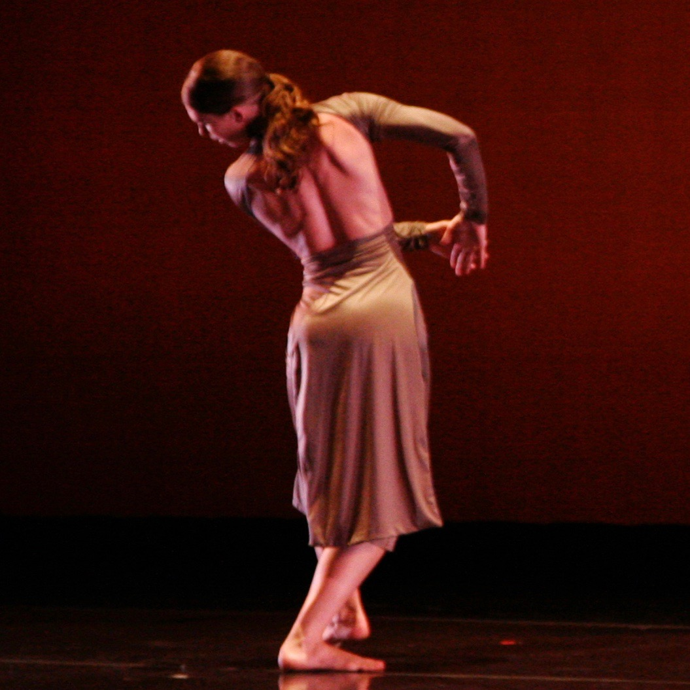
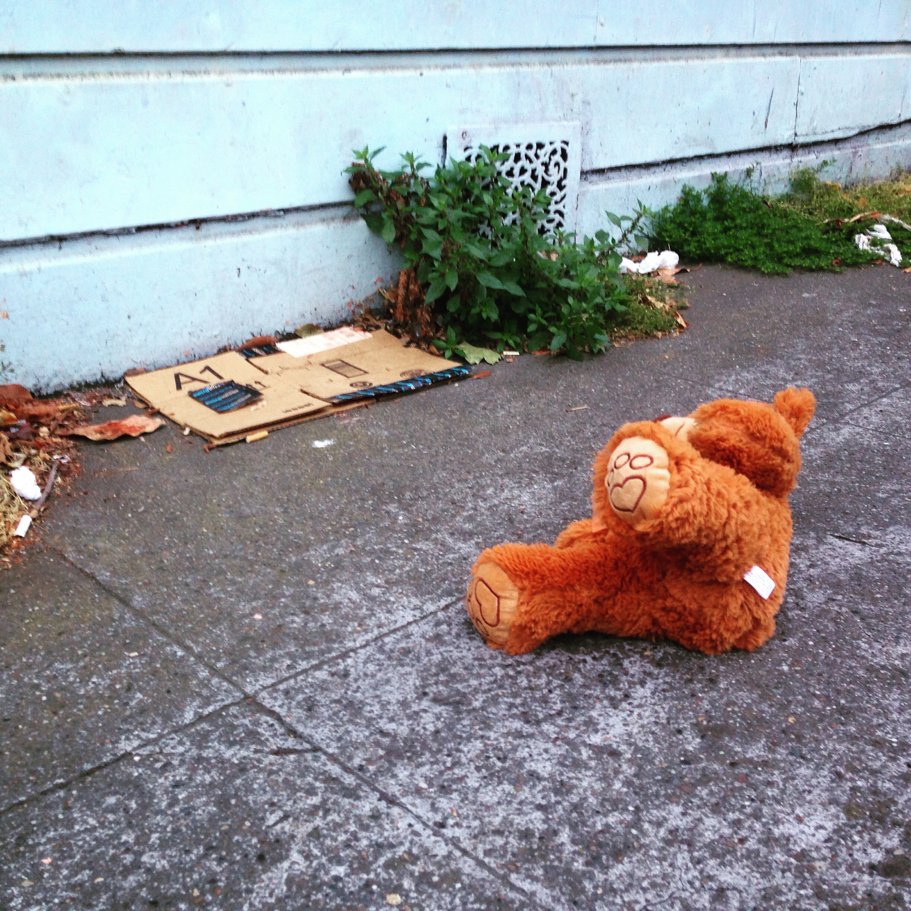

# Follow my adventures in...[Telling Stories with Data](https://welter808.github.io/cwelter_TSWD_portfolio/)

## about me
#### **Christi Welter** (*she/her/hers*) 
I grew up in Hawai'i before moving to the mainland for a BS in Mathematics and a BFA in Dance with Distinction from the University of California, Santa Barbara. Although still harboring dreams of becoming an architect, I spent the last 20 years in New York and San Francisco building work with muscle and bone instead of concrete and steel. I'm now a Masters of Arts Management student at Carnegie Mellon University in Pittsburgh. Let's get creative with administration. I love drinking hot toddies, walking my dog Mamet, and taking photos of abandoned stuffed animals (#leftofurs). 

    

## what i hope to learn
- [ ]  a little art

- [ ]  a little science

- [ ]  a little storytelling

## portfolio
direct links to my projects

[Visualizing Government Debt](/GovDebtViz.md)
